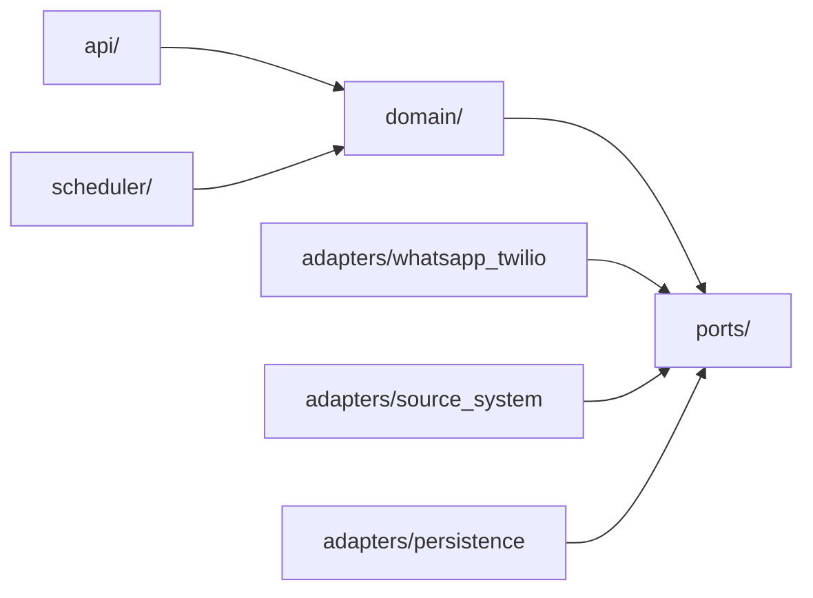
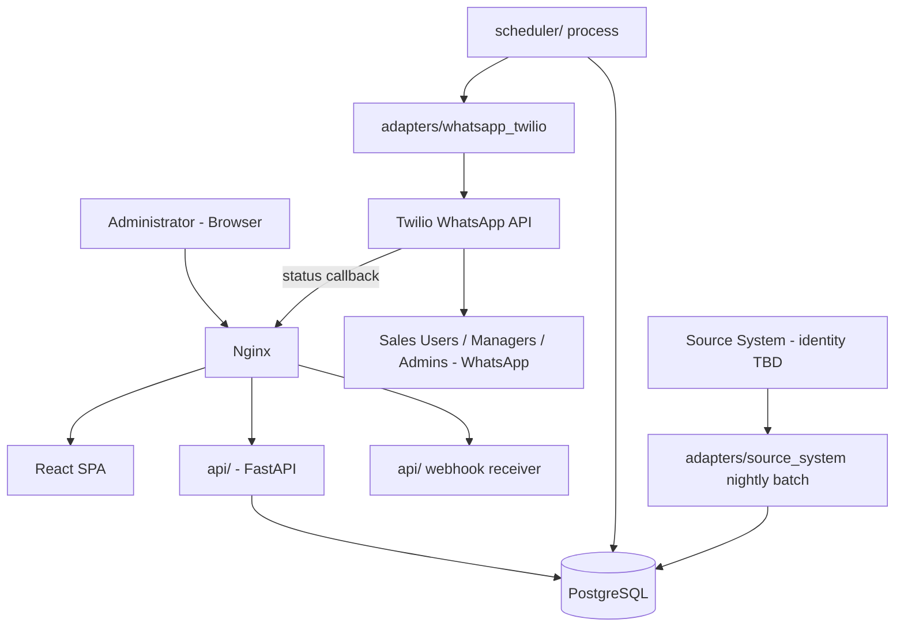
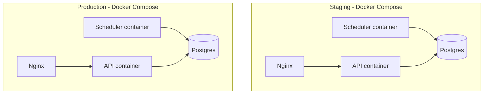
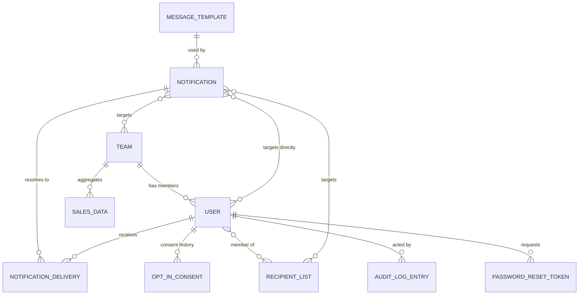

# Architecture Spine — GrowthTrack Phase 1

## Design Paradigm

**Hexagonal (Ports & Adapters).** Two external dependencies are named by the PRD as volatile or unresolved — the WhatsApp provider (Twilio is POC-only; production migration to 360dialog/Gupshup/a local reseller is an explicit future event) and the Source System (identity unknown, PRD Open Question #1). The domain core — metrics computation, brand/doctor ranking, notification targeting/dedup, retry orchestration — depends on neither. It defines ports; adapters implement them.

- `domain/` — core services. No inbound framework dependency, no outbound driver/SDK imports.
- `ports/` — abstract interfaces the domain defines and depends on (`WhatsAppSender`, `SourceSystemImporter`, repository interfaces, `Clock`).
- `api/`, `scheduler/` — inbound adapters that call into `domain/`.
- `adapters/whatsapp_twilio/`, `adapters/source_system/`, `adapters/persistence/` — outbound adapters implementing `ports/`.



No arrow points from `domain/` to any `adapters/*` package — that absence is the rule (see AD-1).

## Invariants & Rules

### AD-1 — Dependency direction is inward only

- **Binds:** all
- **Prevents:** domain/business logic quietly coupling to Twilio, a specific Source System, or SQLAlchemy — the exact coupling that would make the named provider swaps (WhatsApp BSP, Source System) expensive instead of a one-adapter change.
- **Rule:** `domain/` may import from `ports/` only. `api/`, `scheduler/`, and every `adapters/*` package may import `domain/` and `ports/`, never each other. No Twilio SDK type, no Source-System-specific type, and no SQLAlchemy model may appear in a `domain/` function signature. Importing `ports/` types for dependency-injection wiring does not license `api/` or `scheduler/` to *invoke* a port or repository directly for any state-mutating operation — every mutation, including the webhook receiver's (AD-3) and the scheduler's (AD-2), calls into `domain/`, which is the only layer permitted to call a repository port. An inbound adapter that mutates state by calling `adapters/persistence` directly is a violation even though it never imports a concrete adapter type.

### AD-2 — Scheduling & idempotency without a job queue

- **Binds:** CAP-3, CAP-4, FR-6, FR-7, FR-9, SM-3
- **Prevents:** two independently-built send paths (scheduled vs. manual) assuming different dedup or retry mechanisms; a duplicate-send race that SM-3 requires to be zero; a scheduler restart silently producing a "new" Send Event for what should be the same one.
- **Rule:** Retry/scheduling runs on a Postgres-backed job/idempotency table driven by a single in-process scheduler (APScheduler) in the `scheduler/` process — no Redis/Celery in Phase 1 (see Deferred). A **Send Event**'s identity is `(recipient_user_id, operational_day)` for Scheduled Notifications — deliberately *not* a separate `trigger_id`, since FR-6 mandates exactly one global scheduled run per operational day, so the day itself is the trigger — and `(recipient_user_id, notification_id)` for Manual Notifications. Each is enforced by its own **partial/filtered unique index** on `NotificationDelivery` (one per `notification_type`), never a single composite constraint over nullable columns — SQL's NULL-is-distinct-from-NULL semantics silently defeats that. Team/RecipientList membership is resolved **fresh at trigger/send time**, never frozen at Notification-creation time (so a directory change reaches a still-pending send, per FR-9); a recipient reachable via more than one targeting mechanism resolves to one `NotificationDelivery` row before send. The unique index alone stops duplicate *rows*, not a crashed or racing retry re-dispatching against an *existing* row: dispatch must first **atomically claim** the row (`UPDATE NotificationDelivery SET status='sending' WHERE id=? AND status IN ('queued','failed_retryable') RETURNING *`) — only a process that wins the conditional update may call the WhatsApp adapter. A `NotificationDelivery` whose retries are exhausted is left `Failed` and is never re-claimed by the same Send Event (per FR-7) — the next eligible attempt is a new Send Event: the next operational day's scheduled run, or a fresh Manual Notification. Recipient resolution also enforces AD-9's opt-in-consent gate before a `NotificationDelivery` row is created at all. The same resolution logic is exposed read-only (no side effects, no rows created) for the composer's live dedupe-count preview (EXPERIENCE.md's "14 selected → 11 unique") — one resolution function, two callers.

### AD-3 — Delivery-status feedback is an inbound webhook

- **Binds:** FR-7, FR-11
- **Prevents:** a poller and a webhook handler both existing and racing to update the same delivery status.
- **Rule:** One inbound endpoint, `POST /webhooks/twilio/status`, is the only writer of post-send delivery status, and it calls into `domain/` like every other write path — it never touches `adapters/persistence` directly (closing an AD-1 loophole: the webhook is not exempt from domain-level rules just because it's inbound). It must verify the Twilio request signature before accepting a status update. No other code path polls Twilio for status. `NotificationDelivery` stores the provider message SID returned at send time (overwritten on each retry attempt, not kept as history) — the webhook's correlation key back to the right delivery row, but a payload is applied **only if its SID matches the row's current SID**; a payload referencing a superseded attempt is logged and ignored. Status transitions are **monotonic** (`Queued → Sending → Delivered` / `Retrying` / `Failed`); a payload attempting to move status backward is rejected, not applied — this, combined with signature verification, is the replay-attack mitigation (a captured-and-replayed callback can neither be forged nor move state backward).

### AD-4 — Recipient/Team/Notification data ownership

- **Binds:** CAP-5, CAP-8, FR-9, FR-11, entities.md's Team/Notification gap
- **Prevents:** one builder modeling `Recipient Group`/`Recipient Channel` as live WhatsApp platform objects while another treats them as GrowthTrack-internal sets; a `Notification` table trying to be both "what was intended to send" and "what happened to recipient N" at once; and a target spec shape that can't be queried for history/filtering.
- **Rule:** `RecipientList` is the single entity backing both Recipient Group and Recipient Channel (a `kind` field distinguishes them for organizational display only — same fan-out-to-individual-numbers mechanism). `Team` is a standalone entity, not a field. `Notification` (the request/definition: type, template reference, target spec, creator) is a separate table from `NotificationDelivery` (one row per resolved individual recipient: status, attempt count, provider message SID, failure reason) — `NotificationDelivery` is the Send Event unit AD-2 governs. A Notification's target spec is **relational join rows** (`NotificationTarget`, referencing a User, Team, or RecipientList), never a JSON blob — FR-11/CAP-8's history filtering requires querying it. `MessageTemplate` (approved template identifier + variable-slot definitions) is a standalone entity a Notification references — approval itself happens in Twilio/Meta's console, out of scope here (see Deferred). `User`, `Team`, and `RecipientList` are **soft-deleted** (a `Status`/active flag — generalizing `entities.md`'s existing `User.Status`), never hard-deleted, so `NotificationDelivery`/`AuditLogEntry` history is never orphaned.

### AD-5 — Deployment topology, environments, secrets

- **Binds:** all (operational envelope)
- **Prevents:** the web process and the scheduled-send process being conflated such that a web-tier crash or redeploy silently drops a scheduled run.
- **Rule:** Docker Compose defines the API container, a **separate** scheduler container/process, PostgreSQL, and an Nginx reverse proxy in front of both the API and the webhook endpoint. Nginx terminates TLS and redirects all HTTP to HTTPS — the concrete mechanism behind the PRD's "all communication over HTTPS" constraint, not left implicit — pinned at **≥1.30.1 / ≥1.31.0** (CVE-2026-42945 is an unauthenticated RCE-capable flaw in earlier releases, and Nginx fronts the unauthenticated Twilio webhook). Two environments — staging and production — run the identical compose topology; local development reuses the same compose file. Secrets (Twilio credentials, JWT signing key, DB credentials) are injected as environment variables at deploy time and are never committed to the repository. Bangladesh PDPA hosting-region residency is **not** architected around in Phase 1 — it is a flagged pre-launch legal-review item (PRD §10), not a hard NFR here.

### AD-6 — Source System ingestion is a contract, not a system

- **Binds:** CAP-2, CAP-6, CAP-7, PRD Open Question #1
- **Prevents:** domain metrics/ranking logic being written against assumptions specific to whichever ERP/CRM turns out to be real.
- **Rule:** A nightly batch-import adapter (`adapters/source_system/`) lands raw data into a staging table, validates it, transforms it, then upserts into `SalesData`/`BrandPerformance`/`Doctor` through the same repository ports every other write path uses — staging → validate → transform → upsert, in that order, never a direct write to the live tables. Every completed import records its completion timestamp; this is what backs the Dashboard's "Data as of HH:MM" staleness badge (EXPERIENCE.md) — the badge reads the last-successful-import timestamp, not a guess. When the concrete Source System is identified, only this adapter changes.

### AD-7 — Audit Log write is co-transactional [ADOPTED]

- **Binds:** FR-12, CAP-5
- **Prevents:** an administrative action — or a login — taking effect without a corresponding audit record (the PRD states this as a hard requirement, not a design choice this spine is free to relax).
- **Rule:** Every service method that mutates a `User`, `Team`, `RecipientList`, opt-in/out state (AD-9), or the Daily Report schedule writes its data change and its `AuditLogEntry` in the same database transaction. Login events are also written to `AuditLogEntry` (FR-12 requires this explicitly) — the login-handling service method follows the same co-transactional rule even though it isn't a directory mutation. A rollback of one rolls back the other; there is no service method that can commit one without the other.

### AD-8 — One auth enforcement choke-point, with revocation

- **Binds:** CAP-1, FR-1, FR-2
- **Prevents:** an individual route forgetting the Administrator-role check — the single-role gate the PRD relies on for Phase 1's entire RBAC story — and a logged-out or deactivated Administrator's still-unexpired JWT continuing to work.
- **Rule:** Every portal route depends on one shared FastAPI dependency that validates the JWT, the Administrator role, and a revocation check keyed by the JWT's `jti` against a revocation record. No route implements its own inline auth check. Logout and mid-session Administrator deactivation write a revocation record checked by that same dependency — a stateless-JWT-only design cannot satisfy FR-1's "invalidated per policy" or EXPERIENCE.md's deactivated-admin-logged-out-on-next-action requirement, so revocation state is mandatory, not optional hardening.

### AD-9 — Opt-in consent is enforced at resolution, not at dispatch

- **Binds:** FR-9, FR-10, CAP-3, CAP-4
- **Prevents:** one send path (e.g. Manual) checking consent while another (e.g. Scheduled) forgets to, since nothing previously named a single enforcement point.
- **Rule:** Consent state is checked inside the same recipient-resolution step AD-2 uses, before a `NotificationDelivery` row is created — never as an after-the-fact filter at dispatch time, and never duplicated per send path. Changing a `User`'s phone number revokes existing consent; delivery to that `User` is blocked until fresh consent is recorded.

### AD-10 — Operational envelope: health, recovery, backup

- **Binds:** all (SPEC's 99.5% uptime / automatic-recovery constraint)
- **Prevents:** "automatic recovery" being read as anything from "someone gets paged" to "full automatic failover" — two incompatible ops models either could build to the same silent spine.
- **Rule:** Every container in AD-5's compose topology declares a health check and a `restart: always` policy — this is the concrete mechanism satisfying "automatic recovery after failures," not a deferred detail. PostgreSQL data is backed up via an automated daily dump to off-host storage (retention period deferred — PRD Open Question #9). The API exposes a `/health` liveness endpoint polled by an external uptime monitor. Concrete hosting provider and monitoring vendor are deferred (see Deferred) — the mechanism is fixed, the vendor is not.

### AD-11 — Auth security state and Administrator preferences are explicit entities

- **Binds:** FR-1, FR-2, epics.md Story 1.5, Story 1.6, Story 4.4
- **Prevents:** login-lockout state, password-reset tokens, the Daily Report schedule value, and per-Administrator UI preferences being invented ad hoc (a stray column here, an environment variable there) by whoever picks up the story, since none of these had a named home in the original spine.
- **Rule:** `User` gains `failed_login_count` and `locked_until` columns — a login attempt while `locked_until` is in the future is rejected before password verification runs; this is a brute-force-lockout concern, distinct from AD-8's session-revocation mechanism. `PasswordResetToken` is a standalone entity (`user_id`, a hashed token — the raw token is never stored, `expires_at`, `used_at`); a token is single-use, invalidated on first use or on expiry, whichever comes first. `ReportSchedule` is a standalone, single-row entity holding the Daily Report's global send time; Administrator edits go through the same domain-service-plus-co-transactional-audit path as every other mutation (AD-7) — it is application data, not deploy-time configuration, so changing it never requires a redeploy (contrast with AD-5's environment-variable secrets). `User` gains a `theme_preference` column (`light` / `dark` / `system`, default `system`) backing the per-Administrator dark-mode override. All four are `adapters/persistence` additions reachable through existing repository patterns — none require a new port or adapter.

## Consistency Conventions

| Concern | Convention |
| --- | --- |
| Naming (entities, files, interfaces, events) | REST paths are plural-noun resources (`/recipients`, `/teams`, `/notifications/history`), matching `stack.md` precedent. DB tables `snake_case`; API schemas `PascalCase`. Domain vocabulary is PRD-glossary-verbatim across every layer (`Send Event`, `Operational Day`, `Notification`, `NotificationDelivery`, `Team`, `RecipientList`) — no per-layer renaming of the same concept. "Recipient" itself names the *umbrella concept* (any addressable target: `User`, `Team`, or `RecipientList` — AD-4) and is never used as a table or class name, to avoid exactly the ambiguity AD-7 originally had. |
| Data & formats (ids, dates, error shapes, envelopes) | All entity ids are UUIDv4 (cross-service correlation, including Twilio webhook callbacks — never sequential integers). Timestamps are stored and transmitted as ISO 8601 UTC always; conversion to Asia/Dhaka happens only at presentation edges (WhatsApp text, Dashboard, Operational-Day boundary calculation) — Operational Day is a presentation/business-logic concept, never a stored timezone. Money is fixed-precision decimal in base currency units; "Cr BDT" formatting is a presentation-edge concern only. Every REST error response uses one envelope: `{error: {code, message, details}}`. |
| State & cross-cutting (mutation, errors, logging, config, auth) | All writes to `User`/`Team`/`RecipientList`/`Notification`/`NotificationDelivery` go through the domain service layer — no route handler or webhook receiver touches a repository directly (AD-1). `User`/`Team`/`RecipientList` carry an optimistic-concurrency version column; a stale-version write is rejected as a conflict, not silently overwritten — the backing rule for EXPERIENCE.md's Conflict dialog. Structured JSON logging with a correlation/request id threaded from inbound HTTP or scheduler trigger through to the WhatsApp adapter call. Configuration is one typed settings object (`pydantic-settings`) reading environment variables — no scattered `os.environ` calls. (Audit co-transactionality: AD-7. Auth enforcement + revocation: AD-8. Consent gate: AD-9.) |

## Stack

| Name | Version |
| --- | --- |
| Python | 3.13+ (3.12 is security-only maintenance as of 2026) |
| FastAPI | 0.139.0 |
| Pydantic | v2 (bundled with FastAPI 0.139) |
| SQLAlchemy | 2.0.51 |
| Alembic | 1.18.5 |
| PostgreSQL | 18.4 |
| PyJWT | 2.13.0 |
| Password hashing | pwdlib (bcrypt backend) — **not** passlib, which is unmaintained; FastAPI's own 2026 docs recommend pwdlib |
| APScheduler | 3.11.3 |
| Twilio Python SDK | 9.10.9 |
| React | 19.2.7 |
| MUI (@mui/material) | 9.2.0 |
| Nginx | ≥1.30.1 / ≥1.31.0 (CVE-2026-42945 fixed only at these floors or later) |
| Docker / Docker Compose | current stable |

Versions verified current against PyPI/npm/vendor release pages on 2026-07-14 — the why for each pick (not the version) lives in the memlog.

## Structural Seed

### System context



### Deployment & environments



Identical topology in both environments; only environment-variable-injected secrets and connection targets differ (AD-5).

### Core-entity relationships

Only the relationships that were genuinely open (PRD Open Questions #2, #8) are fixed here — full field lists remain owned by `entities.md` and, once code exists, the code itself.



`SalesData`, `BrandPerformance`, and `Doctor` are flat reporting entities with no structural relationships to the notification/recipient graph above (`Doctor.Territory` is a plain attribute, not a modeled entity) — they read from the Source System ingestion path (AD-6) and feed `domain/` metrics/ranking logic directly. `ReportSchedule` (AD-11) is likewise a standalone, relationship-free singleton row, and `failed_login_count`/`locked_until`/`theme_preference` (AD-11) are plain columns on `USER`, not separate entities — none of the four appear in the ERD above for that reason.

### Source tree

```text
growthtrack/
  api/                    # inbound HTTP adapter - FastAPI routers, incl. webhook receiver
  domain/                 # core services: metrics, ranking, notification orchestration, dedup - no external deps
  ports/                  # abstract interfaces domain depends on (WhatsAppSender, SourceSystemImporter, repositories, Clock)
  adapters/
    whatsapp_twilio/      # Twilio implementation of the WhatsApp port
    source_system/        # nightly batch importer implementation
    persistence/          # SQLAlchemy repositories implementing domain repository ports
  scheduler/              # APScheduler jobs - own process entrypoint, separate from api/ (AD-5)
  web/                    # React + MUI admin portal
  alembic/                # DB migrations
  tests/
  docker/                 # Dockerfiles + compose definitions (staging, production)
```

## Capability → Architecture Map

| Capability | Lives in | Governed by |
| --- | --- | --- |
| CAP-1 — JWT auth | `api/auth`, `ports/auth` | AD-8 |
| CAP-2 — Dashboard | `api/dashboard`, `domain/metrics` | AD-1, AD-6 |
| CAP-3 — Automated daily WhatsApp report | `scheduler/`, `domain/notifications`, `adapters/whatsapp_twilio` | AD-1, AD-2, AD-3, AD-9 |
| CAP-4 — Manual notification | `api/notifications`, `domain/notifications`, `adapters/whatsapp_twilio` | AD-1, AD-2, AD-3, AD-9 |
| CAP-5 — Recipient directory management | `api/recipients`, `domain/recipients` | AD-4, AD-7, AD-9 |
| CAP-6 — Brand analytics | `domain/metrics` (ranking), consumed by CAP-2 and CAP-3/4 | AD-1, AD-6 |
| CAP-7 — Doctor visit list | `domain/metrics` (doctor ranking), consumed by CAP-3/4 only | AD-1, AD-6 |
| CAP-8 — Notification history | `api/notifications/history`, reads `NotificationDelivery` | AD-2, AD-4 |
| Audit Log (FR-12, cross-cutting) | every mutating `domain/` service method | AD-7 |
| Auth security state & Administrator preferences (login lockout, password reset, Daily Report schedule, dark-mode preference) | `api/auth`, `api/settings`, `adapters/persistence` | AD-11 |

## Deferred

- **Redis/Celery.** Revisit if real recipient scale or an immediate Phase 2 start invalidates the Postgres + APScheduler assumption (AD-2) — Phase 1's own NFRs don't require it.
- **Production WhatsApp provider migration** (Twilio → 360dialog/Gupshup/a local BDT reseller). Isolated behind `ports/` (AD-1) so it is a future adapter swap, not an architecture change. Note: Gupshup's valuation and revenue have reportedly declined sharply in the past year — a real factor for whoever makes this call later, not disqualifying today.
- **Dedicated secrets manager.** Environment variables suffice at Phase-1 scale (AD-5); revisit at the next real security review.
- **Bangladesh PDPA hosting-region decision.** Legal-review item per PRD §10 — not architected around now.
- **Concrete hosting provider and monitoring/alerting vendor.** AD-10 fixes the mechanism (health checks, restart policy, backups, `/health` endpoint); the provider and the tool that watches it are not chosen yet.
- **Backup retention period**, and, distinctly, **Notification History / Audit Log data retention** (PRD Open Question #9 — how long *rows*, not just backups, are kept before purge/archive). AD-10 establishes automated daily backups; neither retention question is resolved.
- **Support/on-call model and RTO/RPO targets.** AD-10 fixes the recovery *mechanism* (health checks, restart, backups); the response-time targets behind SPEC's 99.5% uptime figure (PRD Open Question #10) are not defined.
- **Exact Achievement %/Growth % formulas.** A finance/business decision (PRD Open Question #3), not an engineering call — `domain/metrics` implements whatever formula is confirmed.
- **WhatsApp template approval workflow.** `MessageTemplate` (AD-4) references an approved template identifier; the approval process itself lives in Twilio/Meta's console and isn't modeled here.
- **Exact retry policy magnitude** (attempt count, backoff) and **JWT session TTL**. Policy values, not structural decisions — left configurable, enforced by AD-2/AD-8's mechanisms regardless of the numbers chosen.
- **Brand top/low/focus ranking thresholds.** A business decision per PRD FR-4's note, not an engineering call.
- **Concrete Source System identity.** Unknown per PRD Open Question #1 — only the ingestion contract (AD-6) is fixed.
- **Bulk recipient import (CSV).** Deferred pending PRD Open Question #14 on real org scale.
- **Multi-Team membership per User.** Assumed one Team per User per `entities.md`'s flat `Team` field (AD-4's ERD) — revisit if a real org chart needs otherwise.
